# Set up used
Algoritm is runned on Python 3.7

## Discret optimization
# Traveling Salesman Problem (TSP)
The  aim is to find the shortest path, so you visit all cities without visiting the same twice.

Two TSP problems has to be solved. One with 38 cities (Djibouti) and the other with 194 cities (Qatar)
Data used can be found on the following link: http://www.math.uwaterloo.ca/tsp/world/countries.html

Algoritm used to solve the 2 TSP problems is a Genetic Algorithm is well suited for this kind of problem:
- each chromosome represents a route through all cities. Each gene represent a city.
- All chromosomes are permutation of the genes.

**Djibouti TSP problems**
- 38 cities
- Global Optimum is reached at 6656

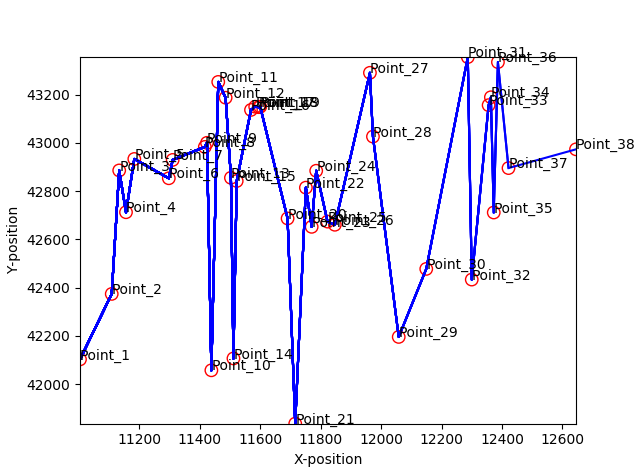

 Notebook associated to the problem: [notebook_tsm_dj38](tsm_dj38.ipynb)

**Qatar TSP problems**
- 194 cities
- Global Optimum is reached at

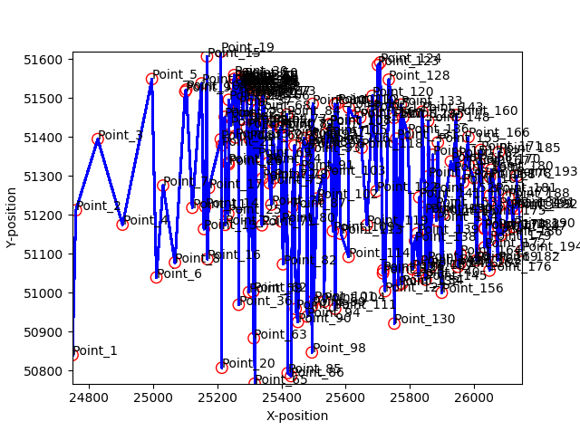

Notebook associated to the problem: [notebook_tsm_qa194](./tsm_qa194.ipynb)

## Continuous optimization

The aim of this part is to  to optimize the 6 first functions 6 Functions (F1-F6)from CEC2008: description [here](doc/CEC2008_TechnicalReport.pdf)
The  is done for both dimension D = 50 and D = 500.

### F1: Shifted Sphere Function
#### D = 50

Notebook associated to the problem:[notebook_Schift_sphere_50](./Schift_sphere_50.ipynb)

- The chosen algorithm : **BFGS**
- Fitness: 0.000026
- The number of function evaluations : 520
- The computational time (sec) : 5.395
- The convergence curve :

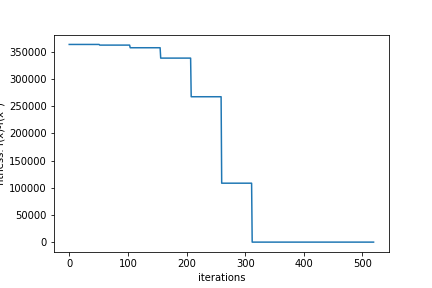

#### D = 500

Notebook associated to the problem: [notebook_Schift_sphere_500](./Schift_sphere_500.ipynb)

- The chosen algorithm : **BFGS**
- Fitness: ~ 0.0
- The number of function evaluations : 5020
- The computational time (sec) : 0.305
- The convergence curve :

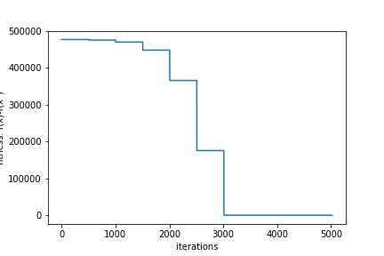

### F3 : Shifted Rosenbrock’s Function
#### D = 50

Notebook associated to the problem: [notebook_rosenbrock_50](./rosenbrock_50.ipynb)

- The chosen algorithm :**bee_colony**
- Fitness: ~ 0.002831
- The number of function evaluations : 4901
- The computational time (sec) :8.360
- The convergence curve (fitness as a function of time)

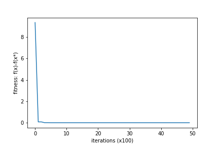

#### D = 500

Notebook associated to the problem:[notebook_rosenbrock_500](./rosenbrock_500.ipynb)

- The chosen algorithm :**bee_colony**
- Fitness: ~ 0.001836
- The number of function evaluations : 4901
- The computational time (sec) : 10.626
- The convergence curve (fitness as a function of time)

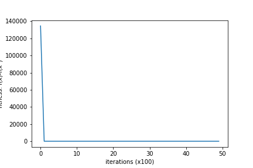

### F4 : Shifted Rastrigin’s Function
#### D = 50

Notebook associated to the problem: [notebook_Schift_rastrigin_50](./Schift_rastrigin_50.ipynb)

- The chosen algorithm :**saDE**
- Fitness: ~ 0.141031
- The number of function evaluations : 901
- The computational time (sec) : 4.884
- The convergence curve :

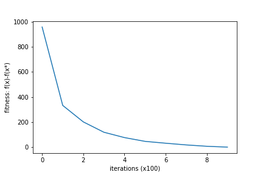

#### D = 500

Notebook associated to the problem: [notebook_Schift_rastrigin_500](./Schift_rastrigin_500.ipynb)

- The chosen algorithm :ABC: Artificial Bee Colony
- Fitness: ~ 0
- The number of function evaluations : 79901
- The computational time (sec) : 241.044
- The convergence curve :

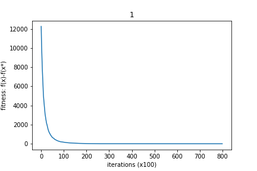

### F5 : Shifted Griewank’s Function
#### D = 50

Notebook associated to the problem: [notebook_Schift_griewank_50](./Schift_griewank_50.ipynb)

- The chosen algorithm :**PSO: Particle Swarm Optimization**
- Fitness: ~ 0
- The number of function evaluations : 2401 iterations
- The computational time (sec) : 7.452
- The convergence curve :

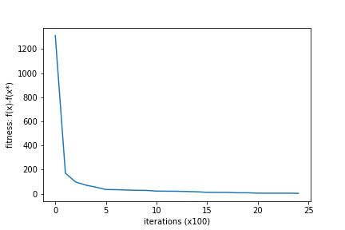

#### D = 500

Notebook associated to the problem: [notebook_Schift_griewank_500](./Schift_griewank_500.ipynb)

- The chosen algorithm :**PSO: Particle Swarm Optimization**
- Fitness: ~ 0.000002
- The number of function evaluations : 2401 iterations
- The computational time (sec) : 31.694
- The convergence curve :

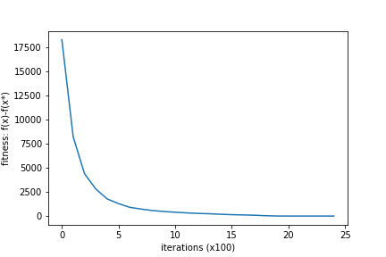

### F6 : Shifted Ackley’s Function
#### D = 50

Notebook associated to the problem: [notebook_Schift_ackley_50](./Schift_ackley_50.ipynb)

- The chosen algorithm :**saDE: Self-adaptive Differential Evolution**
- Fitness: ~ 0.053
- The number of function evaluations : 1901 iterations
- The computational time (sec) : 2.414
- The convergence curve :

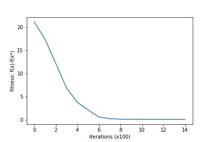

#### D = 500

Notebook associated to the problem: [notebook_Schift_ackley_500](./Schift_ackley_500.ipynb)

- The chosen algorithm :**PSO: Particle Swarm Optimization**
- Fitness: ~ 0.005444
- The number of function evaluations : 4901 iterations
- The computational time (sec) : 39.131
- The convergence curve (fitness as a function of time)

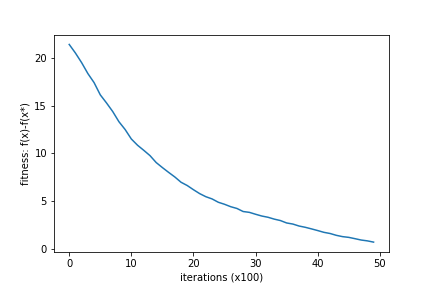
